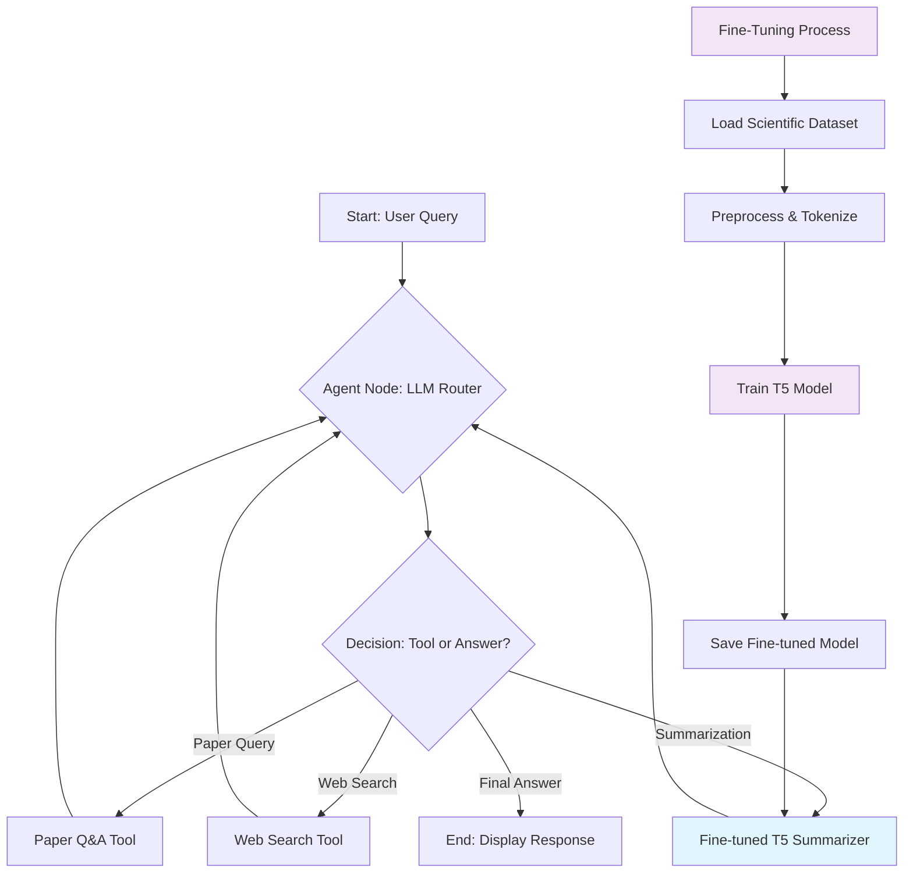

# Multi-Tool AI Research Agent
This project implements a sophisticated, conversational AI agent designed to assist with scientific research. The agent leverages the power of Large Language Models (LLMs) through the API and is built using the LangGraph framework to enable intelligent, tool-using capabilities.
The agent can dynamically choose between querying a local, specialized knowledge base of scientific papers or searching the web for general, up-to-date information, all while maintaining conversational context. This project serves as a demonstration of building modern, modular, and robust AI systems.

## Features
* **Conversational Memory**: The agent remembers previous turns in the conversation to answer follow-up questions contextually.
* **Multi-Tool Capability**: The agent has access to a suite of tools to gather information:
  * **Paper Q&A Tool**: A Retrieval-Augmented Generation (RAG) pipeline to perform semantic search and answer detailed questions about a local corpus of scientific documents.
  * **Web Search Tool**: Integrates with the Google Custom Search API to find real-time information and provide sourced answers with links.
  * **AI Summarization Tool**: Uses a fine-tuned T5 model specifically trained on scientific papers to generate high-quality summaries and abstracts.
* **Intelligent Tool Routing**: Utilizes a powerful LLM and LangGraph to analyze the user's query and autonomously decide which tool is the most appropriate to use.
* **Fine-Tuned Model Training**: Built-in interface to train and fine-tune T5 models for scientific paper summarization.
* **Local Persistence**: Chat history is saved locally to a `chat_history.json` file, allowing sessions to be resumed.
* **Interactive UI**: A user-friendly chat interface built with Streamlit.

## Architecture
The agent is built on LangGraph, which orchestrates the flow of logic as a state machine. This allows for complex, cyclical reasoning where the agent can think, act, and observe the results of its actions before deciding on the next step.

### High-Level Flow:
1. **Input**: The user's query and the existing chat history are loaded into the agent's state.
2. **Agent (LLM Router)**: The LLM analyzes the current state and decides whether it can answer directly or if it needs to use a tool.
3. **Conditional Routing**:
   * If a tool is chosen, the graph transitions to the Action node.
   * If no tool is needed, the graph transitions to the End state.
4. **Action (Tool Executor)**: The selected tool is executed with the appropriate input.
5. **Loop**: The output of the tool is added to the agent's state, and the process loops back to the Agent node for re-evaluation with the new information.
6. **Output**: Once the agent determines it has a complete answer, it generates the final response for the user.

### Code Flow Diagram


## Fine-Tuning
The application includes a sophisticated fine-tuning system that allows you to train a custom T5 model specifically for scientific paper summarization.

### Fine-Tuning Features:
* **Automated Dataset Loading**: Uses the `franz96521/scientific_papers` dataset from Hugging Face
* **Custom Preprocessing**: Tokenizes full scientific papers and their abstracts for optimal training
* **Memory-Efficient Training**: Configured with reduced batch sizes and optimized parameters for various hardware configurations
* **Real-Time Progress Tracking**: Visual progress bars and status updates during the training process
* **Model Persistence**: Automatically saves and loads fine-tuned models for future use
* **Built-in Testing**: Includes sample text evaluation to verify model performance

### Training Process:
1. **Dataset Preparation**: Downloads and preprocesses scientific papers with abstracts
2. **Tokenization**: Converts text to model-compatible format with proper truncation and padding
3. **Model Training**: Fine-tunes T5-small model using scientific paper data
4. **Evaluation**: Tests model performance on held-out validation data
5. **Deployment**: Automatically integrates trained model into the agent's tool suite

### Usage:
- Navigate to the sidebar in the application
- Click "🚀 Train Model" to start the fine-tuning process
- Monitor progress through the real-time interface
- Once complete, the model is automatically available for summarization tasks

The fine-tuned model significantly improves summarization quality for scientific content compared to generic pre-trained models.

## Live Demo
You can try out the application at: [https://my-research-agent-4ecs8tthjtvfb4tym6sq4b.streamlit.app](https://my-research-agent-4ecs8tthjtvfb4tym6sq4b.streamlit.app)
*Note: The demo may not always be available depending on server status.*

## Tech Stack
* **Frameworks**: LangChain, LangGraph, Streamlit
* **LLM & APIs**: NIM (gpt-oss120b), Google Custom Search API
* **Data & Retrieval**: Hugging Face Datasets, FAISS, Sentence-Transformers
* **Fine-Tuning**: Transformers, PyTorch, Hugging Face Datasets
* **Core Language**: Python 3.10+

## Setup and Installation
Follow these steps to set up and run the project locally.

### 1. Prerequisites
You will need API keys from the following services:
* **API Key**.
* **Google Cloud API Key**: Available from the [Google Cloud Console](https://console.cloud.google.com/).
* **Google Search Engine ID**: Create a Programmable Search Engine that searches the entire web [here](https://cse.google.com/cse/).

### 2. Clone the Repository
```bash
git clone https://github.com/ParaDhim/my-research-agent.git
cd my-research-agent
```

### 3. Set Up Environment Variables
Create a file named `.env` in the root of the project directory and add your API keys:
```
API_KEY="..."
GOOGLE_API_KEY="..."
GOOGLE_CSE_ID="..."
```
**Note**: The application is configured to load these variables. Ensure the `.env` file is included in your `.gitignore` to avoid committing secrets.

### 4. Install Dependencies
It is recommended to use a virtual environment.
```bash
python -m venv venv
source venv/bin/activate  # On Windows, use `venv\Scripts\activate`
pip install -r requirements.txt
```

### 5. Build the Vector Store
The first time you run the application, it will download the scientific papers dataset, process it, and create a local FAISS vector store. This may take several minutes. Subsequent runs will load the pre-built index from the `faiss_index_scientific_papers/` directory.

### 6. Run the Streamlit Application
```bash
streamlit run app.py
```
Navigate to `http://localhost:8501` in your web browser to interact with the agent.

## Usage
The application provides a chat interface. You can ask questions that test the agent's different capabilities.

* **To query the scientific papers** (triggers `paper_qa_tool`):
  * "What are the main results of the paper on sparsity-certifying graph decompositions?"
* **To search the web** (triggers `web_search_tool`):
  * "Who is Geoffrey Hinton and what are his main contributions to AI?"
* **To generate summaries** (triggers `summarize_paper_tool`):
  * "Summarize the latest research on graph theory"
  * "Generate an abstract for this paper"
* **To test conversational memory**:
  * "What is a Tk decomposition?"
  * (After the agent answers) "How is that used in the upper range?"

## Project Structure
```
.
├── faiss_index_scientific_papers/  # Saved FAISS index
├── t5-small-scientific-paper-summarizer/  # Fine-tuned T5 model
├── hf_cache/                       # Hugging Face cache directory
├── .env                            # Local environment variables (API keys)
├── .gitignore                      # Git ignore file
├── README.md                       # This file
├── streamlit_app.py                          # The main Streamlit application
├── agent.py                        # LangGraph agent definition and tools
├── fine_tune_model.py             # Fine-tuning interface and model training
├── vector_store.py                # Vector store utilities and RAG pipeline
├── requirements.txt               # Python dependencies
└── chat_history.json             # Saved chat history (generated at runtime)
```

## Future Improvements
* **Add More Tools**: Integrate a Python code interpreter or additional specialized tools for complex tasks.
* **Advanced Fine-Tuning**: Implement domain adaptation for different scientific fields
* **Containerization**: Package the application with Docker for more portable and scalable deployment.
* **Enhanced Error Handling**: Improve the agent's ability to handle failed tool calls or API errors gracefully.
* **Streaming Tool Outputs**: Stream the raw output from tools like web search to the UI in real-time for a better user experience.
* **Model Versioning**: Add support for multiple fine-tuned model versions and A/B testing.

## License
This project is licensed under the MIT License. See the LICENSE file for details.
